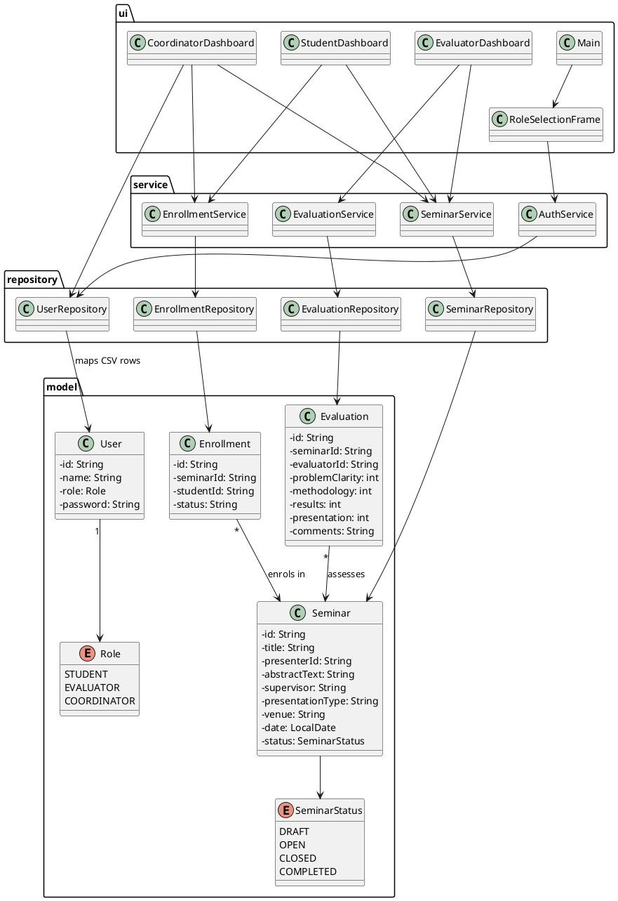
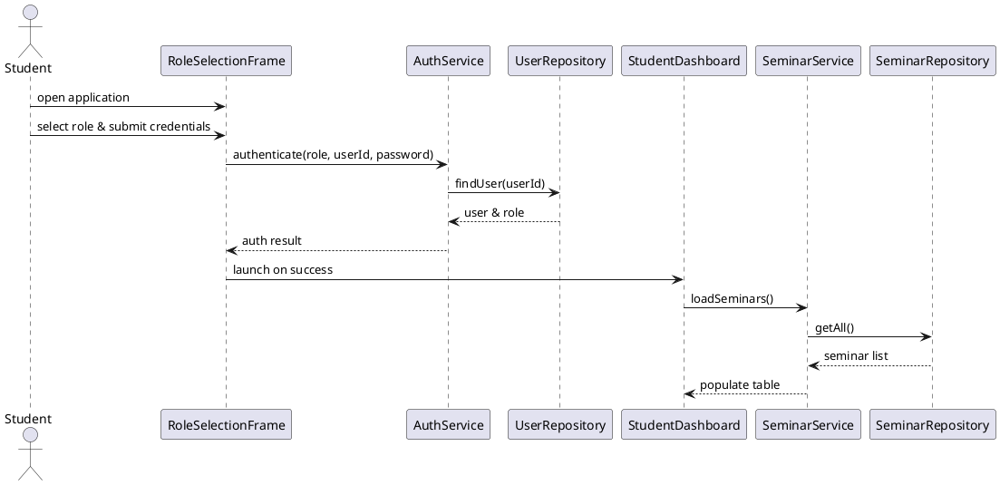
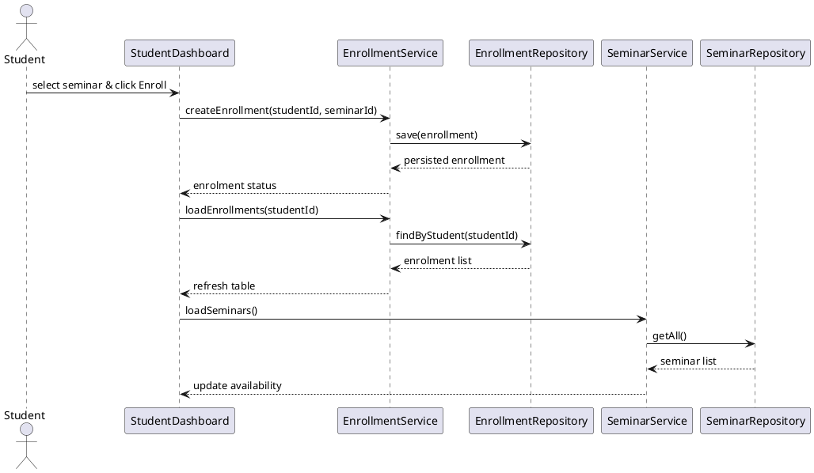
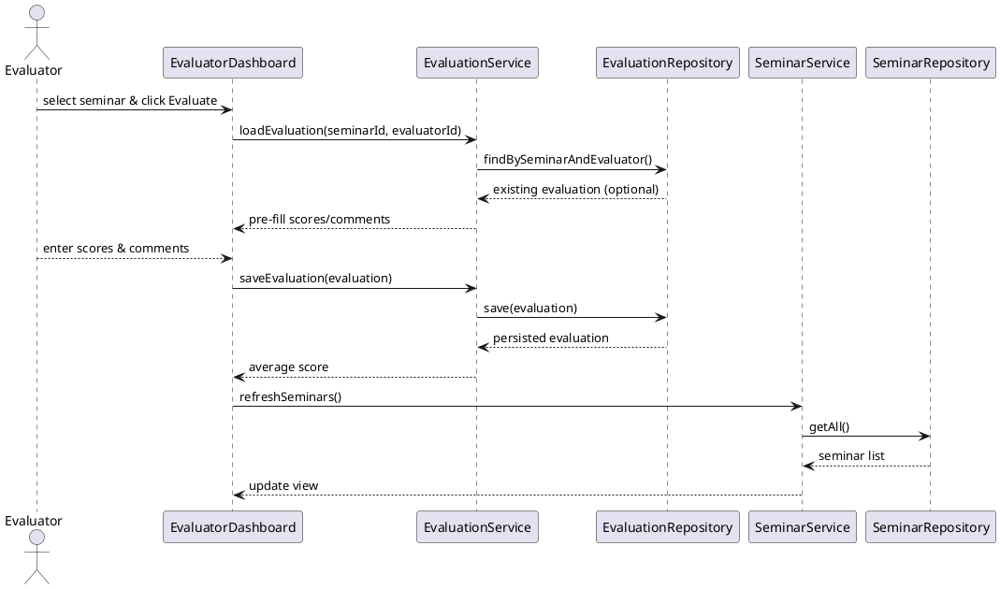

# CCP6224 OOAD

## Assignment Report: Seminar Management System

**Tutorial:** TT5L  \\
**Group:** 5  \\
**Lecturer:** Dr. Shahid

**Prepared by:**

- [Insert group member names and student IDs]

---

# 1. Introduction
This project implements a **Seminar Management System** in Java with a Swing-based user interface. The system supports postgraduate seminar administration for three distinct roles—Student, Coordinator, and Evaluator. The design follows object-oriented principles with a clear separation of concerns: core entities live in the model package, business rules are encapsulated in services, and each role is provided with its own graphical interface. Persistence is handled via CSV files to keep the implementation lightweight yet extensible.

# 2. System Overview
## 2.1 Primary Roles
The system defines three primary roles, as illustrated in the class diagram:

- **Student**: registers for and presents seminars.
- **Evaluator**: assesses seminars against predefined criteria.
- **Coordinator**: creates seminars, assigns presenters, and oversees participation.

The `Role` enumeration restricts valid roles to `STUDENT`, `EVALUATOR`, and `COORDINATOR`. A companion `SeminarStatus` enumeration captures seminar states (`DRAFT`, `OPEN`, `CLOSED`, `COMPLETED`).

## 2.2 Layered Architecture
The application is organized into four logical layers:

- **Models**: Data entities such as `Seminar`, `User`, `Evaluation`, and `Enrollment`. For example, `Seminar` stores the identifier, title, presentation date, venue, and status; `Enrollment` links a student to a seminar with an enrolment status; `Evaluation` tracks evaluator and seminar IDs along with four rubric scores and comments.
- **Repositories**: Handle reading and writing CSV files for each model (`Users`, `Seminars`, `Enrollments`, `Evaluations`).
- **Services**: Encapsulate business rules such as creating/updating seminars, enrolling students, saving evaluations, and authenticating users.
- **User Interface**: Swing frames for each role, including a `RoleSelectionFrame` for authentication and dashboards for Students, Coordinators, and Evaluators.

Data flows from the user interface through services to repositories and then to CSV storage. This structure allows the persistence layer to be swapped in the future without altering UI or business logic.

## 2.3 Organisation of Key Files
### 2.3.1 Key Files Table
| Area | File(s) | Purpose |
| --- | --- | --- |
| Models | `Seminar.java`, `Enrollment.java`, `Evaluation.java`, `User.java`, `Role.java`, `SeminarStatus.java` | Represent domain entities and supporting enums. |
| Services | `SeminarService.java`, `EnrollmentService.java`, `EvaluationService.java`, `AuthService.java` | Implement business rules for seminars, enrolments, evaluations, and authentication. |
| Repositories | `SeminarRepository.java`, `EnrollmentRepository.java`, `EvaluationRepository.java`, `UserRepository.java` | Provide CSV-based persistence for each model. |
| User Interface | `RoleSelectionFrame.java`, `StudentDashboard.java`, `CoordinatorDashboard.java`, `EvaluatorDashboard.java`, `Main.java` | Deliver Swing screens for login and role-specific dashboards. |
| Utilities | `IdGenerator.java`, `FileUtils.java` | Supply ID generation and CSV file helpers. |
| Data | `data/*.csv` | Seed and runtime CSV data for users, seminars, enrolments, and evaluations. |

*Note: Detailed descriptions for each file are provided in the following subsections.*

### 2.3.2 Detailed File Descriptions
#### Model Files
- **Seminar.java**: Represents a seminar with fields such as `id`, `title`, `presenterId`, `date`, `venue`, and `status`. Used to move seminar information between layers.
- **Enrollment.java**: Records a student’s participation in a specific seminar with fields `id`, `seminarId`, `studentId`, and a status (e.g., registered, accepted).
- **Evaluation.java**: Stores a seminar evaluation with a seminar ID, evaluator ID, four scores from 1–5, and a free-text comment.
- **User.java**: Represents a user with `id`, `name`, `role` (from the `Role` enum), and a password for authentication.

#### Service Files
- **SeminarService.java**: Provides functions to create, modify, and retrieve seminars and manage their status. Relies on `SeminarRepository` for storage and uses the `SeminarStatus` enumeration to manage states.
- **EnrollmentService.java**: Allows students to enrol in seminars and prevents duplicate enrolments. Returns an `Enrollment` object with an updated status and triggers `loadEnrollments()` in the student dashboard to display current registrations.
- **EvaluationService.java**: Enables evaluators to create or update seminar evaluations and computes the average score, which is shown in a confirmation message when saved.
- **AuthService.java**: Handles login validation and ensures the selected role matches the user’s role.

#### Repository Files
Each model has a corresponding repository that maps to a CSV file. These repositories read data from CSV files, convert rows into model objects, and write them back when modified. This separation allows the persistence layer to be swapped for a database without changing the business logic.

#### User Interface Files
- **RoleSelectionFrame.java**: Enables the user to choose a role and enter credentials. When the login button is pressed, the service validates the inputs and opens the corresponding dashboard.
- **StudentDashboard.java**: Displays a table of available seminars (`ID`, `Title`, `Date`, `Venue`, `Status`). Selecting a seminar and clicking **Enroll** registers the student; if no row is selected, the system shows a warning. Successful enrolment saves the record and refreshes the list. A second table shows the student’s current enrolments.
- **CoordinatorDashboard.java**: Provides buttons for **Create Seminar**, **Edit Seminar**, and **Refresh**. The coordinator can view a seminar table and a participant table (enrolment ID, student name, seminar ID, status). Creating or editing a seminar opens a form with fields such as title, presenter ID, abstract, supervisor, presentation type, venue, date, and status. After clicking **Save**, the data are stored and the tables are updated.
- **EvaluatorDashboard.java**: Lists available seminars with an **Evaluate** button. Selecting a seminar opens an evaluation dialog with four spinner fields (problem clarity, methodology, results, presentation) and a text field for comments. Saving the evaluation computes the average score and displays it to the evaluator.

#### Utility Files
- **IdGenerator.java**: Generates unique IDs for various objects.
- **FileUtils.java**: Provides helper functions for reading and writing CSV files and ensuring resources are closed correctly.

## 2.4 Data Files
The system stores its data in the `data/` directory as CSV files: `users.csv`, `seminars.csv`, `enrollments.csv`, and `evaluations.csv`. Users can remove these files to reset the seed data.

# 3. User Interface Screens
The system provides several Swing-based screens. Below is a description of each screen along with guidance on where to insert the corresponding screenshot.

## 3.1 Role Selection and Login Screen
- **Image location:** *Insert the role-selection and login screen image here – Figure 1*
- **Figure description:** Shows the `RoleSelectionFrame`, where the user selects their role from a drop-down list (Student, Evaluator, or Coordinator) and enters their user ID and password. When the **Login** button is pressed, the credentials are sent to `AuthService` for verification. If valid, the appropriate dashboard opens.

## 3.2 Student Dashboard
- **Image location:** *Insert the student dashboard image here – Figure 2*
- **Figure description:** Displays a table of available seminars with columns (`ID`, `Title`, `Date`, `Venue`, `Status`). An **Enroll** button registers the selected seminar; if no row is selected, a warning message is shown. On success, a new row is added to the enrolments table and a confirmation is displayed. The **Refresh** button updates the lists, and the lower table shows current registrations.

## 3.3 Coordinator Dashboard
- **Image location:** *Insert the coordinator dashboard image here – Figure 3*
- **Figure description:** Contains seminar and participant tables. The **Create Seminar** and **Edit Seminar** buttons open forms for adding a new seminar or modifying an existing one. The form includes fields such as title, presenter ID, abstract, supervisor, presentation type, venue, date, and status; clicking **Save** writes the data and updates the tables.

## 3.4 Evaluator Dashboard
- **Image location:** *Insert the evaluator dashboard image here – Figure 4*
- **Figure description:** Lists seminars with an **Evaluate** button. Selecting a seminar and pressing **Evaluate** opens an evaluation dialog with four score spinners (1–5) and a comments area. After pressing **Save Evaluation**, the average score is computed and displayed in a confirmation message.

## 3.5 Persistent Storage Evidence
- **Image location:** *Insert an image demonstrating that data persist after restarting the application – Figure 5*
- **Figure description:** Should show how seminar, enrolment, and evaluation data remain after closing and relaunching the application, confirming successful persistence to CSV files. Capture screenshots of the tables after restarting and compare them with previous sessions.

# 4. Usage Scenarios
This section explains end-to-end operation for each role.

## 4.1 Logging In
1. The user starts the application and the role-selection screen appears.
2. They select their role (Student, Evaluator, or Coordinator) and enter their user ID and password.
3. When **Login** is pressed, `AuthService` validates the credentials and role.
4. If the credentials are correct, the login screen closes and the appropriate dashboard opens; otherwise, an error message is displayed.

## 4.2 Student Scenario
1. The student opens the `StudentDashboard` and views the table of available seminars.
2. They select a seminar, review its details, and click **Enroll**. If they forget to select a row, the system displays a warning.
3. Upon enrolment, the system saves the `Enrollment` and shows a confirmation with the enrolment status.
4. The enrolments table refreshes to show the student’s current records.
5. The student can use **Refresh** at any time to update the tables.

## 4.3 Coordinator Scenario
1. The coordinator opens the `CoordinatorDashboard`, viewing tables of seminars and participants.
2. To create a new seminar, they click **Create Seminar** to open a form with fields for title, presenter, abstract, supervisor, presentation type, venue, date, and status.
3. After completing the form, they click **Save** to store the seminar and refresh the tables.
4. To modify an existing seminar, they select a row in the seminar table and click **Edit Seminar**; the form shows the current values for editing.
5. The **Refresh** button updates the seminars and participants tables with the latest data.

## 4.4 Evaluator Scenario
1. The evaluator views the seminar list in `EvaluatorDashboard` and selects a seminar to assess.
2. They click **Evaluate**, which opens an evaluation window containing four score fields (each 1–5) and a comments field.
3. If an evaluation already exists, the scores and comment are pre-loaded.
4. After entering their scores and comment, they click **Save Evaluation** to store the evaluation and see the average score in a confirmation message.
5. The evaluator can assess multiple seminars; each evaluation is saved to a CSV file.

# 5. Diagrams
The following UML diagrams illustrate the system structure and key interactions. PlantUML source is provided for university-level assessment and reproducibility.

## 5.1 UML Class Diagram

## 5.2 Sequence Diagram 1 – Login and Seminar Retrieval

## 5.3 Sequence Diagram 2 – Student Enrolment Flow

## 5.4 Sequence Diagram 3 – Evaluator Evaluation Flow

# 6. Conclusion
The Seminar Management System provides an integrated environment supporting students, coordinators, and evaluators through a simple graphical interface. This report documents the system’s layered architecture, file structure, screen expectations, UML diagrams, and role-specific workflows. The CSV-based persistence approach demonstrates data durability across sessions while keeping the design adaptable for future extensions or alternative storage technologies.
